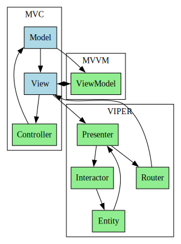
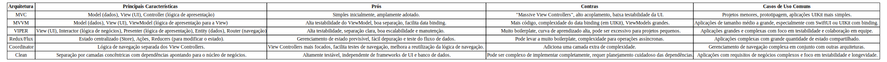

**1. Model-View-Controller (MVC)**

- **Descrição:** Divide a aplicação em três partes:
    - **Model:** Dados e lógica de negócios.
    - **View:** Exibe os dados e interage com o usuário.
    - **Controller:** Intermediário, lida com a lógica de apresentação e atualiza Model e View.
- **Prós:** Simples de entender inicialmente, amplamente adotado (especialmente em UIKit/AppKit). Boa separação conceitual.
- **Contras:** Frequentemente leva a "Massive View Controllers" com muita lógica de apresentação, alto acoplamento entre View e Controller, testabilidade limitada da UI.

**2. Model-View-ViewModel (MVVM)**

- **Descrição:** Introduz uma camada entre a View e o Model:
    - **Model:** Dados e lógica de negócios (igual ao MVC).
    - **View:** Passiva, se liga às propriedades do ViewModel para exibir dados e encaminha ações.
    - **ViewModel:** Lógica de apresentação, prepara dados para a View e expõe comandos. Não tem referência direta à View.
- **Prós:** Maior testabilidade do ViewModel (independente da View), melhor separação de responsabilidades, reduz o acoplamento, facilita o data binding (especialmente em SwiftUI).
- **Contras:** Pode introduzir mais código (a camada ViewModel), complexidade no gerenciamento do data binding (em UIKit), pode levar a ViewModels grandes.

**3. VIPER (View-Interactor-Presenter-Entity-Router)**

- **Descrição:** Uma arquitetura mais estruturada com separação rigorosa:
    - **View:** Exibe a UI e encaminha ações para o Presenter.
    - **Interactor:** Contém a lógica de negócios pura.
    - **Presenter:** Lógica de apresentação, formata dados para a View e recebe ações da View.
    - **Entity:** Objetos de dados básicos.
    - **Router:** Lógica de navegação.
- **Prós:** Alta testabilidade de cada componente, separação de responsabilidades clara, facilita a colaboração em grandes equipes, boa escalabilidade e manutenção.
- **Contras:** Grande quantidade de código boilerplate, curva de aprendizado mais alta, pode ser excessivo para projetos pequenos.

**Outras Arquiteturas e Padrões Menos Comuns (mas importantes):**

- **Redux/Flux:** Arquiteturas de fluxo de dados unidirecional, populares em aplicações complexas com gerenciamento de estado centralizado. Envolvem um Store (estado), Actions (para mudar o estado) e Reducers (funções que aplicam as mudanças). (Ex: ReSwift em Swift)
- **Coordinator:** Um padrão de navegação que desacopla a lógica de navegação dos View Controllers, tornando-os mais focados na apresentação. Frequentemente usado em conjunto com outras arquiteturas como MVC ou MVVM.
- **Clean Architecture (Robert C. Martin):** Uma arquitetura que enfatiza a separação de responsabilidades por camadas concêntricas, com as entidades de negócio no centro e as dependências apontando para dentro. Pode ser implementada de várias maneiras em Swift, muitas vezes inspirando variações do VIPER.

**Escolhendo a Arquitetura Certa:**

A escolha da arquitetura depende de vários fatores, incluindo:

- **Tamanho e complexidade do projeto:** Projetos maiores e mais complexos geralmente se beneficiam de arquiteturas mais estruturadas como MVVM ou VIPER.
- **Tamanho da equipe:** Arquiteturas com boa separação de responsabilidades facilitam o trabalho em equipe.
- **Testabilidade:** Se a testabilidade é uma prioridade alta, MVVM e VIPER são boas escolhas.
- **Curva de aprendizado:** MVC é mais simples para iniciantes, enquanto VIPER tem uma curva maior.
- **Framework de UI:** SwiftUI se integra naturalmente com padrões reativos e MVVM, enquanto UIKit tradicionalmente usa MVC (mas pode se beneficiar de MVVM ou VIPER).

Relacionados: [[MVC]] [[MVVM]] [[Viper]]