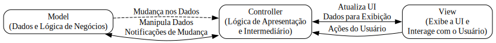

O padrão de arquitetura Model-View-Controller (MVC) é um dos padrões mais clássicos e amplamente utilizados no desenvolvimento de software, especialmente para construir interfaces gráficas de usuário (GUIs). Embora o SwiftUI tenha introduzido uma abordagem mais declarativa e arquiteturas como MVVM e Redux estejam ganhando popularidade, entender o MVC ainda é fundamental, especialmente ao trabalhar com UIKit/AppKit ou ao interagir com código mais antigo.

O MVC divide a aplicação em três partes interconectadas:

1. **Model:** Contém os dados da aplicação e a lógica de negócios. Ele gerencia o estado da aplicação e fornece uma interface para acessar e manipular esses dados. O Model é independente da interface do usuário.
    
2. **View:** É responsável por apresentar os dados ao usuário e capturar as interações do usuário. Em contextos de GUI, a View geralmente consiste nos elementos visuais (labels, botões, tabelas, etc.) e na sua estrutura. A View não deve conter nenhuma lógica de negócios; ela apenas exibe o que o Model fornece e notifica o Controller sobre as ações do usuário.
    
3. **Controller:** Atua como um intermediário entre o Model e a View. Ele recebe as ações do usuário da View, atualiza o Model de acordo e, em seguida, atualiza a View com os dados modificados do Model. O Controller contém a lógica de apresentação e coordena o fluxo de dados entre o Model e a View.
    

**Diagrama Simplificado:**




**Fluxo de Interação Típico:**

1. O usuário interage com um elemento na **View** (por exemplo, pressiona um botão).
2. A **View** notifica o **Controller** sobre essa ação do usuário.
3. O **Controller** recebe a notificação e atualiza o **Model** conforme necessário (por exemplo, altera um dado).
4. O **Model** notifica o **Controller** sobre a mudança em seus dados (geralmente através de mecanismos como delegates, notificações ou bindings).
5. O **Controller** recebe a notificação do Model e atualiza a **View** com os novos dados para refletir a mudança na interface do usuário.

**Exemplo em Swift (UIKit):**

Vamos criar um exemplo simples de um contador usando MVC em UIKit.

**1. Model (`CounterModel.swift`):**

```swift
import Foundation

protocol CounterModelDelegate: AnyObject {
    func counterDidChange(to value: Int)
}

class CounterModel {
    private var count: Int = 0
    weak var delegate: CounterModelDelegate?

    func increment() {
        count += 1
        delegate?.counterDidChange(to: count)
    }

    func decrement() {
        count -= 1
        delegate?.counterDidChange(to: count)
    }

    func getCount() -> Int {
        return count
    }
}
```

- O `CounterModel` mantém um contador privado (`count`).
- Ele define um protocolo `CounterModelDelegate` para notificar o Controller sobre as mudanças no contador.
- As funções `increment()` e `decrement()` modificam o contador e notificam o delegate.
- `getCount()` permite acessar o valor atual do contador.

**2. View (`CounterView.swift`):**

```swift
import UIKit

protocol CounterViewDelegate: AnyObject {
    func incrementButtonTapped()
    func decrementButtonTapped()
}

class CounterView: UIView {
    weak var delegate: CounterViewDelegate?

    let counterLabel: UILabel = {
        let label = UILabel()
        label.text = "0"
        label.textAlignment = .center
        label.font = .systemFont(ofSize: 24)
        return label
    }()

    let incrementButton: UIButton = {
        let button = UIButton(type: .system)
        button.setTitle("+", for: .normal)
        button.titleLabel?.font = .systemFont(ofSize: 36)
        return button
    }()

    let decrementButton: UIButton = {
        let button = UIButton(type: .system)
        button.setTitle("-", for: .normal)
        button.titleLabel?.font = .systemFont(ofSize: 36)
        return button
    }()

    override init(frame: CGRect) {
        super.init(frame: frame)
        setupUI()
        incrementButton.addTarget(self, action: #selector(incrementTapped), for: .touchUpInside)
        decrementButton.addTarget(self, action: #selector(decrementTapped), for: .touchUpInside)
    }

    required init?(coder: NSCoder) {
        fatalError("init(coder:) has not been implemented")
    }

    private func setupUI() {
        addSubview(counterLabel)
        addSubview(incrementButton)
        addSubview(decrementButton)

        // Layout usando Auto Layout (exemplo simplificado)
        counterLabel.translatesAutoresizingMaskIntoConstraints = false
        incrementButton.translatesAutoresizingMaskIntoConstraints = false
        decrementButton.translatesAutoresizingMaskIntoConstraints = false

        NSLayoutConstraint.activate([
            counterLabel.centerXAnchor.constraint(equalTo: centerXAnchor),
            counterLabel.centerYAnchor.constraint(equalTo: centerYAnchor),

            incrementButton.topAnchor.constraint(equalTo: counterLabel.bottomAnchor, constant: 20),
            incrementButton.centerXAnchor.constraint(equalTo: centerXAnchor, constant: 50),
            incrementButton.widthAnchor.constraint(equalToConstant: 80),

            decrementButton.topAnchor.constraint(equalTo: counterLabel.bottomAnchor, constant: 20),
            decrementButton.centerXAnchor.constraint(equalTo: centerXAnchor, constant: -50),
            decrementButton.widthAnchor.constraint(equalToConstant: 80),
        ])
    }

    func updateCounterLabel(with value: Int) {
        counterLabel.text = "\(value)"
    }

    @objc private func incrementTapped() {
        delegate?.incrementButtonTapped()
    }

    @objc private func decrementTapped() {
        delegate?.decrementButtonTapped()
    }
}
```

- O `CounterView` define um protocolo `CounterViewDelegate` para notificar o Controller sobre as interações dos botões.
- Ele contém um `UILabel` para exibir o contador e dois `UIButton`s para incrementar e decrementar.
- Os targets dos botões são definidos para chamar métodos internos (`incrementTapped`, `decrementTapped`), que por sua vez notificam o delegate.
- A função `updateCounterLabel(with:)` é usada para atualizar a exibição do contador.

**3. Controller (`CounterViewController.swift`):**

```swift
import UIKit

class CounterViewController: UIViewController, CounterViewDelegate, CounterModelDelegate {

    private let model = CounterModel()
    private let counterView = CounterView()

    override func loadView() {
        view = counterView
    }

    override func viewDidLoad() {
        super.viewDidLoad()
        counterView.delegate = self
        model.delegate = self
        updateViewWithModel()
    }

    private func updateViewWithModel() {
        counterView.updateCounterLabel(with: model.getCount())
    }

    // MARK: - CounterViewDelegate

    func incrementButtonTapped() {
        model.increment()
    }

    func decrementButtonTapped() {
        model.decrement()
    }

    // MARK: - CounterModelDelegate

    func counterDidChange(to value: Int) {
        updateViewWithModel()
    }
}
```

- O `CounterViewController` cria instâncias do `CounterModel` e `CounterView`.
- No `loadView()`, ele define a `counterView` como a view principal do ViewController.
- No `viewDidLoad()`, ele se define como delegate da `counterView` e do `model`.
- A função `updateViewWithModel()` busca o valor atual do Model e atualiza a View.
- As funções do protocolo `CounterViewDelegate` (`incrementButtonTapped`, `decrementButtonTapped`) recebem as ações da View e chamam os métodos correspondentes no Model.
- A função do protocolo `CounterModelDelegate` (`counterDidChange(to:)`) é chamada quando o Model muda, e o Controller então atualiza a View.

**Vantagens do MVC:**

- **Separação de Responsabilidades:** Cada componente (Model, View, Controller) tem uma responsabilidade clara, o que torna o código mais organizado, fácil de entender e manter.
- **Reusabilidade:** O Model pode ser reutilizado por diferentes Views, e as Views podem ser usadas para exibir diferentes Models (com os Controllers adequados).
- **Testabilidade:** A separação facilita a criação de testes unitários para o Model e o Controller, pois eles não dependem diretamente da View.
- **Desenvolvimento em Paralelo:** Diferentes desenvolvedores podem trabalhar no Model, View e Controller simultaneamente com menos conflitos.

**Desvantagens e Críticas ao MVC:**

- **Acoplamento entre View e Controller:** Em implementações práticas, muitas vezes há um acoplamento forte entre a View e o Controller. A View precisa saber qual Controller notificar, e o Controller frequentemente precisa acessar elementos específicos da View para atualizá-los.
- **"Massive View Controller":** É comum que os View Controllers acabem contendo muita lógica de apresentação, tornando-se grandes e difíceis de gerenciar. Isso viola o princípio da separação de responsabilidades.
- **Dificuldade em Testar a Interface do Usuário:** Testar a interação entre a View e o Controller pode ser desafiador.

**O MVC no Contexto do Desenvolvimento Apple:**

- O UIKit (para iOS, tvOS) e o AppKit (para macOS) são frameworks tradicionalmente baseados no padrão MVC. Os `UIViewControllers` e `NSViewControllers` desempenham o papel de Controllers.
- No entanto, ao longo dos anos, várias variações e padrões evoluíram para abordar as limitações do MVC, como o Model-View-ViewModel (MVVM) e o Model-View-Intent (MVI).
- O SwiftUI, com sua abordagem declarativa e bindings de dados, adota uma arquitetura mais próxima do MVVM ou de fluxos de dados reativos, minimizando a necessidade de um Controller tradicional como no UIKit.

**Conclusão sobre MVC:**

O MVC é um padrão fundamental para entender a arquitetura de muitas aplicações, especialmente aquelas construídas com UIKit e AppKit. Embora tenha suas desvantagens e alternativas mais modernas estejam ganhando espaço, seus princípios de separação de responsabilidades ainda são valiosos. Ao trabalhar em projetos existentes ou que interagem com código UIKit/AppKit, um bom entendimento do MVC é essencial. Além disso, compreender o MVC ajuda a entender as motivações por trás de padrões arquiteturais mais recentes como MVVM e Redux.